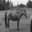
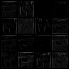
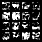

# CNN-Feature-Extraction

This project investigates how each CNN layer extracts features from given images, including how the mutual information between an input image and layer activations changes as the model is trained.

## Table of Contents

- [Description](#description)
- [Installation](#installation)
- [Quick Start](#quick-start)
- [Example](#example)
- [TODO List](#todo-list)

## Description

This project explores how CNN layers learn to extract important features from an image during a classification task. The CIFAR-10 dataset is used for training. Feature extraction is visualized through intermediate activations, and mutual information is computed for each epoch to analyze learning dynamics.

## Installation

```bash
git clone https://github.com/chindanaitrakan/cnn-feature-extraction.git
cd cnn-feature-extraction
pip install -r requirements.txt
```

## Quick Start

Start training the simple CNN model
```bash
cd src
python train.py
```

Perform feature extraction on an evaluation image
```bash
python test.py
```

View training progress, confusion matrix, computational graph, PCA, and intermediate activations via tensorboard
```bash
tensorboard --logdir ./src/runs/cifar10_experiment
```
## Example

Feature extraction is performed on an image of a horse. It is noticeable that the first CNN layer learns the edges of the image, while the subsequent CNN layers extract deeper, more abstract representations of the horse. These representations are then passed to the fully connected layer for the classification task.

<table>
  <tr>
    <td align="center"><strong>Input Image</strong></td>
    <td align="center"><strong>First CNN Activations</strong></td>
    <td align="center"><strong>Last CNN Activations</strong></td>
  </tr>
  <tr>
    <td></td>
    <td></td>
    <td></td>
  </tr>
</table>


## TODO List

- [x] **Train the CNN model**
- [x] **Perform feature extraction**
- [x] **Analyse mutual information**


